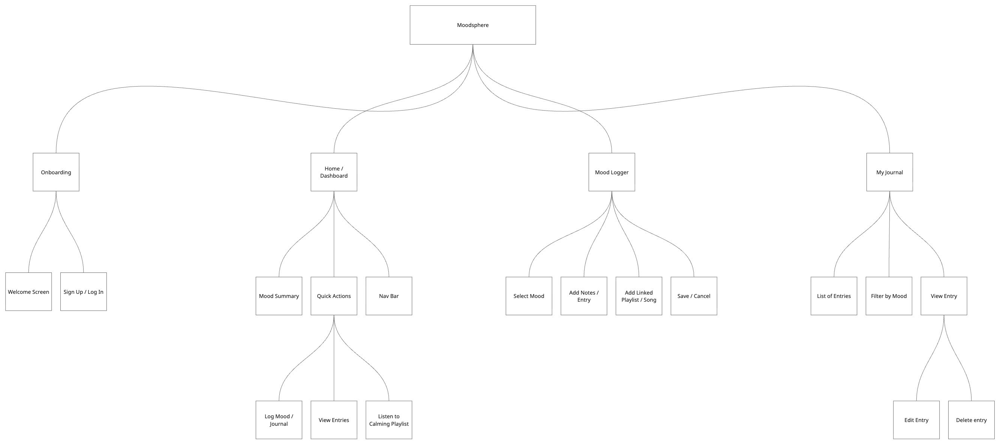
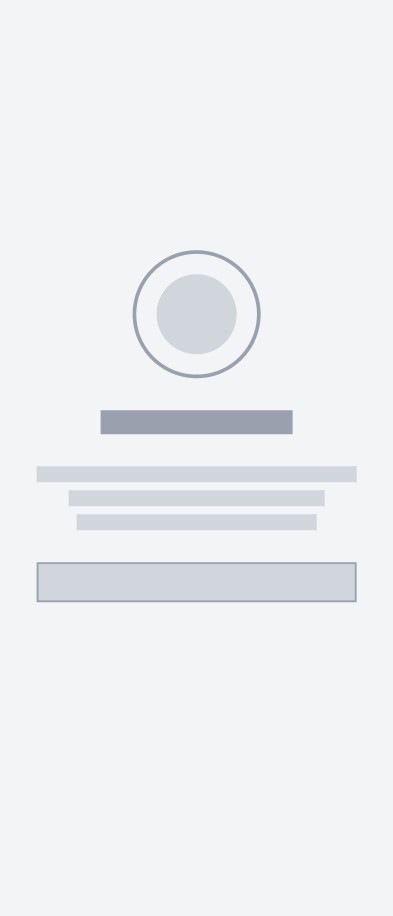
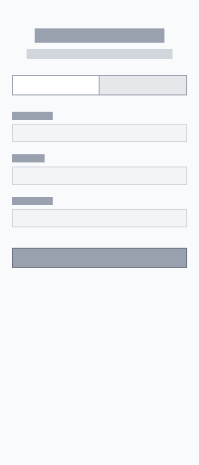
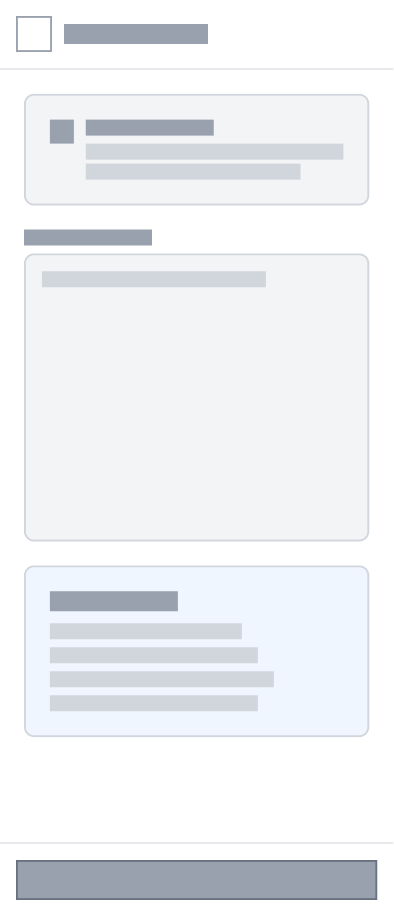
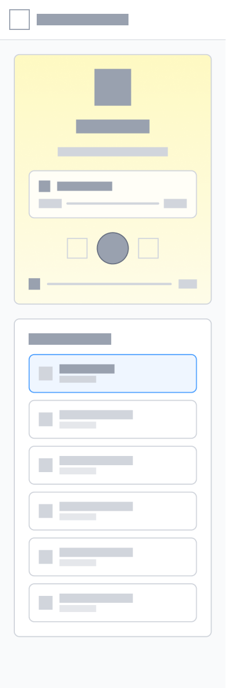
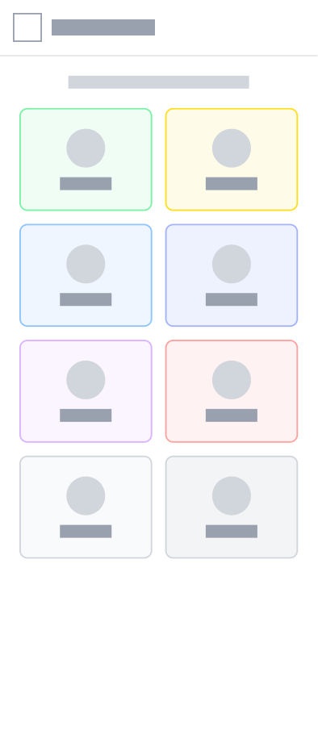
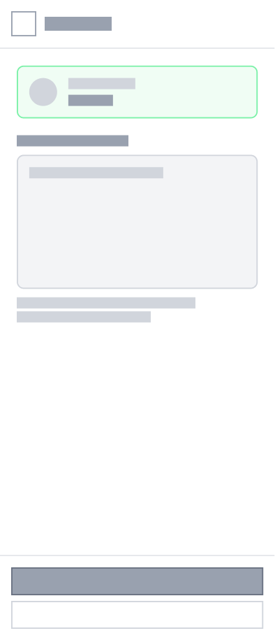
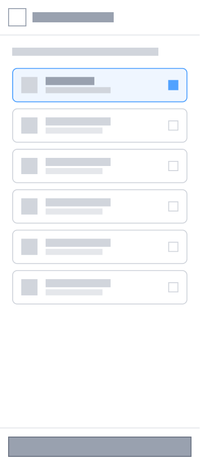
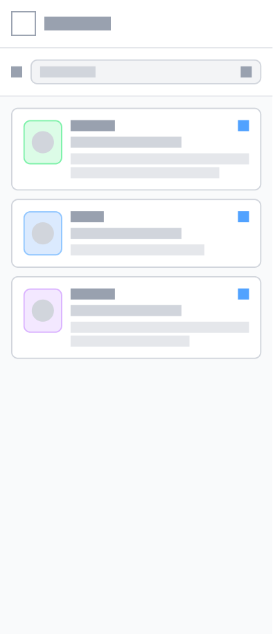
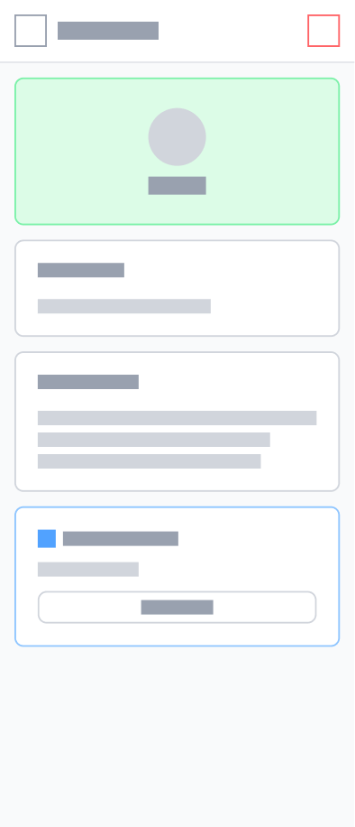

# UX Design – Moodsphere

## App Map

---

## Wireframes

### 1. Welcome / Splash Screen

The welcome screen introduces users to Moodsphere and provides entry points to sign up or log in.

### 2. Sign Up

Users can sign up using email and password.

### 3. Log In

Users can log in using email and password.

### 4. Home / Dashboard

Users can add daily reflection, view ball with varying colors based on mood, add journal entry, view entries, or listen to a calming playlist.

### 5. Reflection

Users can add a reflection based on today's prompt and view tips on what to write.

### 6. Playlist Listener

Users can choose from multiple playlists and listen to one based on their mood.

### 7. Mood Logger

Users can choose from 8 different moods and log one for their journal entry.

### 8. Mood Logger

Users can add a journal entry paired up with their selected mood.

### 9. Playlist Selector

Users can select a playlist to add to their journal entry to match or improve their mood.

### 10. Journal Entries

Users can view all of their logged journal entries and filter based on mood.

### 11. Specific Journal Entry

Users can view a specific, selected journal entry previously logged.